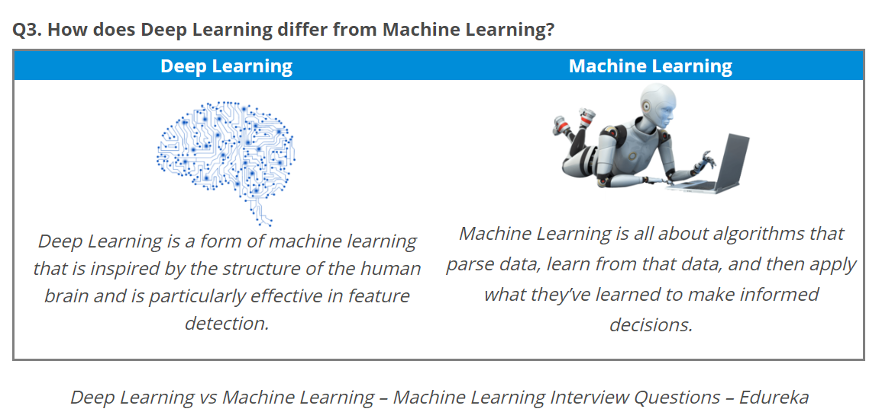

# Top DEEP Learnng Interview Questions

## Q1. What's deep learning

“Deep learning is a particular kind of machine learning that achieves **great power** and **flexibility** by learning to represent the world as **nested hierarchy of concepts**, with each concept defined in relation to simpler concepts, and more abstract representations computed in terms of less abstract ones.”

## Q2: Differene between machine learning and deep learning

1.  Data dependencies

    The most important difference between deep learning and traditional machine learning is its performance as the scale of data increases. When the data is small, deep learning algorithms don’t perform that well. This is because deep learning algorithms need a large amount of data to understand it perfectly. On the other hand, traditional machine learning algorithms with their handcrafted rules prevail in this scenario. Below image summarizes this fact.

2. Hardware dependencies

    Deep learning algorithms heavily depend on high-end machines, contrary to traditional machine learning algorithms, which can work on low-end machines. This is because the requirements of deep learning algorithm include GPUs which are an integral part of its working. Deep learning algorithms inherently do a large amount of matrix multiplication operations. These operations can be efficiently optimized using a GPU because GPU is built for this purpose.

3. Feature engineering
    
    Deep learning algorithms try to learn high-level features from data. This is a very distinctive part of Deep Learning and a major step ahead of traditional Machine Learning. Therefore, deep learning reduces the task of developing new feature extractor for every problem. Like, Convolutional NN will try to learn low-level features such as edges and lines in early layers then parts of faces of people and then high-level representation of a face.
4. Problem Solving approach

    When solving a problem using traditional machine learning algorithm, it is generally recommended to break the problem down into different parts, solve them individually and combine them to get the result. Deep learning in contrast advocates to solve the problem end-to-end.

5. Execution time

    Usually, a deep learning algorithm takes a long time to train. This is because there are so many parameters in a deep learning algorithm that training them takes longer than usual. State of the art deep learning algorithm ResNet takes about two weeks to train completely from scratch. Whereas machine learning comparatively takes much less time to train, ranging from a few seconds to a few hours.

    This is turn is completely reversed on testing time. At test time, deep learning algorithm takes much less time to run. Whereas, if you compare it with k-nearest neighbors (a type of machine learning algorithm), test time increases on increasing the size of data. Although this is not applicable on all machine learning algorithms, as some of them have small testing times too.

 
