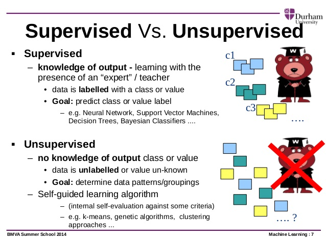
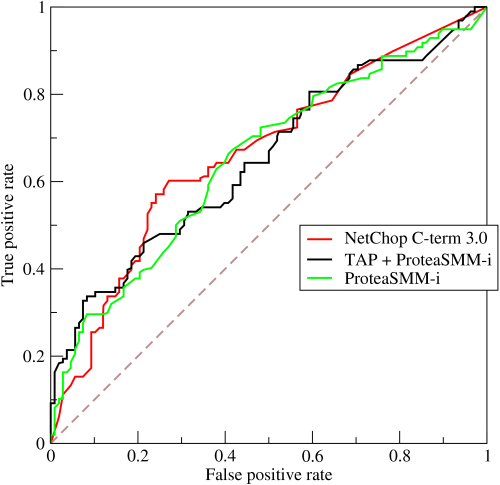
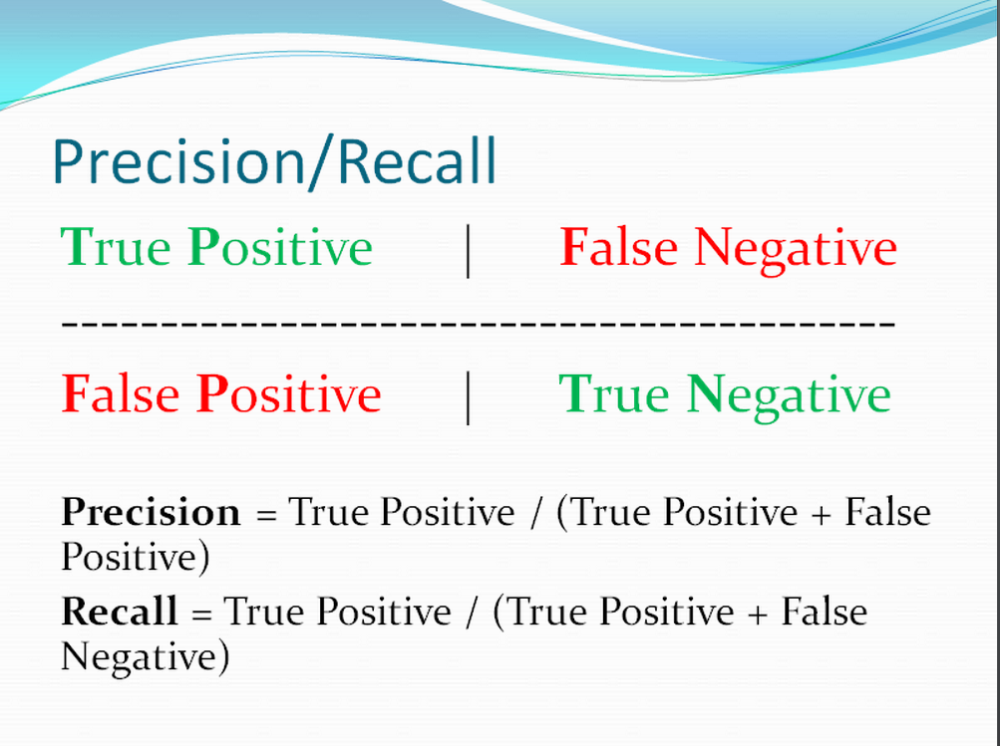
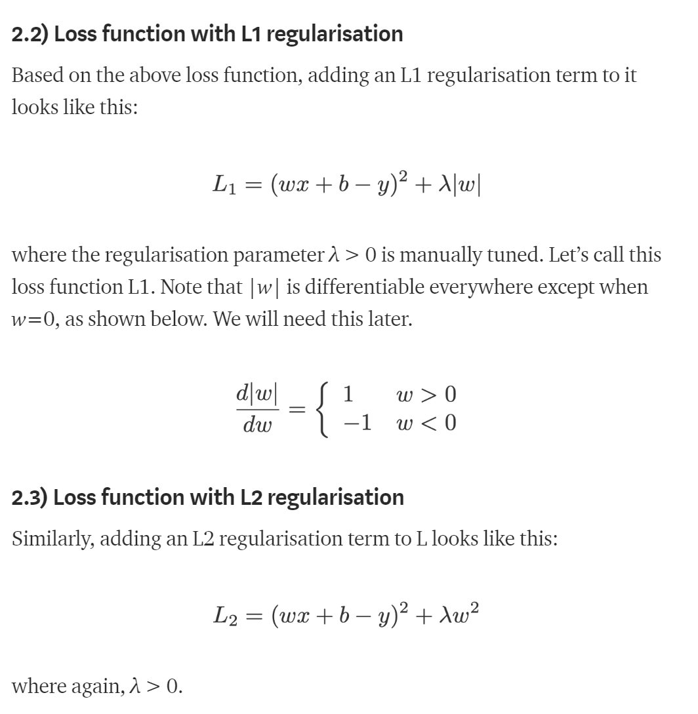

# Top Machine Learnng Interview Questions

## General Questions

### Q1 - What’s the trade-off between bias and variance?

+ Bias is error due to **erroneous or overly simplistic assumptions** in the learning algorithm you’re using. This can lead to the **model underfitting** your data, making it *hard for it to have high predictive accuracy* and for you to generalize your knowledge from the training set to the test set..

+ Variance is error due to **too much complexity** in the learning algorithm you’re using. This leads to the algorithm being highly sensitive to high degrees of variation in your training data, which can lead your model to overfit the data. You’ll be carrying **too much noise from your training data for your model** to be very useful for your test data.

The bias-variance decomposition essentially decomposes the learning error from any algorithm by adding the bias, the variance and a bit of irreducible error due to noise in the underlying dataset. Essentially, if you make the model more complex and add more variables, you’ll lose bias but gain some variance — in order to get the optimally reduced amount of error, you’ll have to tradeoff bias and variance. You don’t want either high bias or high variance in your model.

More reading:  [Bias-Variance Tradeoff (Wikipedia)](https://en.wikipedia.org/wiki/Bias–variance_tradeoff)

Keywords: *simplifying assumptions*, *complexity*

### Bias Error

Bias are the **simplifying assumptions** made by a model to make the target function easier to learn.
Generally, linear algorithms have a high bias making them fast to learn and easier to understand but generally less flexible. In turn, they have lower predictive performance on complex problems that fail to meet the simplifying assumptions of the algorithms bias.

    • Low Bias: Suggests less assumptions about the form of the target function.

    • High-Bias: Suggests more assumptions about the form of the target function.

Examples of low-bias machine learning algorithms include:

    Decision Trees,
    KNN - k-Nearest Neighbors 
    SVM - Support Vector Machines.

Examples of high-bias machine learning algorithms include:

    Linear Regression
    Linear Discriminant Analysis
    Logistic Regression.
 
Bias = Assumptions made by a model to make the target function or learn the model

So, simple model usually has a lot of assumptions then the bias will also be higher as well. For example, linear regression, logistic regression. These model is not easy to overfit
Overfit is mostly happened for the Low Bias and high variance 

For the complex model, it doesn't need so complicated assumptions to learn the model. So, it should be low bias. But this will tend to be high variance, the  easier to be overfitted. 

### Variance Error

Variance is the amount that the estimate of the target function will change if different training data was used.

The target function is estimated from the training data by a machine learning algorithm, so we should expect the algorithm to have some variance. Ideally, it should not change too much from one training dataset to the next, meaning that the algorithm is good at picking out the hidden underlying mapping between the inputs and the output variables.

Machine learning algorithms that have a high variance are strongly influenced by the specifics of the training data. This means that the specifics of the training have influences the number and types of parameters used to characterize the mapping function.

    • Low Variance:
    Suggests small changes to the estimate of the target function with changes to the training dataset.

    • High Variance: 
    Suggests large changes to the estimate of the target function with changes to the training dataset.

Generally, **nonlinear machine learning algorithms that have a lot of flexibility have a high variance**. For example, decision trees have a high variance, that is even higher if the trees are not pruned before use.

Examples of low-variance machine learning algorithms include: 

    Linear Regression
    Linear Discriminant Analysis
    Logistic Regression.
Examples of high-variance machine learning algorithms include: 
    Decision Trees,
    k-Nearest Neighbors
    Support Vector Machines.

### Q2 - Overfitting and Underfitting

In Machine learning, generalization usually refers to the ability of an algorithm to be effective across a range of inputs and applications.

Suppose that we are designing a machine learning model. How a model is said to be a good machine learning model? By Checking if it generalizes any new input data from the problem domain in a proper way. This helps us to make predictions in the future data, the data model has never seen.

* A model is good if it neither underfit or overfits 

1. Underfitting:

     A statistical model is said to have underfitting when it cannot capture the underlying trend of the data. If the data contains too much information that the model cannot take, the model is going to underfit for sure.

    It usually happens if 
	1. We have less data to train the model
	2. Or quite high amount of features
	3. When we try to build a linear model with a non-linear data
	4. Too simple model
    
    The machine learning model are too easy and flexible to be applied on such a minimal data and therefore the model will probably make a lot of wrong predictions.

    **Low Variance but high bias.**

2. Overfitting

    Overfitting occurs when a statistical model or machine learning algorithm captures **the noise of the data**. Intuitively, overfitting occurs when the model or the algorithm **fits the data too well**. 

    **The model is Low bias but high variance**

    an excessively complicated model applied to a not so complicated dataset.

    How to avoid the overfitting
	1. Cross - Validation: K-fold cross validation. Partition the data into k subsets, called folds. Then iteratively train the model on k-1 folds while using the remaining fold as the test set.
	2. Train with mode data
	Won't work every time. Training with more data can help the algorithms detect the signal better. But if you add more noisy data, this will not help. You must make sure the data is clean and relevant.
	3. Remove the features
	Manually remove the irrelevant input features to improve the model generalizability.
	4. Early Stopping
	When we train the mode, we can measure how well each iteration of the model perform. 
	Up until a certain number of iterations, new iterations improve the model. After that point, however, the model's ability to generalize can weaken as it begins to overfit the training data.
	5. Regularization
	Regularization refers to a broad range of techiniques forcing your model to be simpler. 
	    
        * For example, prune a decision tree, dropout 
	    * Add a penalty parameter to the cost function in regression

## Q3- What is the difference between supervised and unsupervised machine learning?
More reading: What is the difference between supervised and unsupervised machine learning? (Quora)

### Supervised Learning
Supervised learning requires training labeled data. For example, in order to do classification (a supervised learning task), you’ll need to first label the data you’ll use to train the model to classify data into your labeled groups. 

### Unsupervised Learning
Unsupervised learning, in contrast, does not require labeling data explicitly.

## Q4 - How is KNN different from k-means clustering?

More reading: How is the k-nearest neighbor algorithm different from k-means clustering? (Quora)

1. Different on K

    * KNN: K is neighbors count
    * K-means: K is the cluster count 

2. supervised classification vs unsupervised clustering
    
    * K-Nearest Neighbors is a supervised classification algorithm
    * k-means clustering is an unsupervised clustering algorithm. 

While the mechanisms may seem similar at first, what this really means is that in order for K-Nearest Neighbors to work, you need labeled data you want to classify an unlabeled point into (thus the nearest neighbor part). 

K-means clustering requires only a set of unlabeled points and a threshold: the algorithm will take unlabeled points and gradually learn how to cluster them into groups by computing the mean of the distance between different points.

The critical difference here is that KNN needs labeled points and is thus supervised learning, while k-means doesn’t — and is thus unsupervised learning.

## Q5 - Explain how a ROC curve works.

More reading: Receiver operating characteristic (Wikipedia)

The ROC curve is a graphical representation of the contrast between **true positive rates** and the **false positive rate** at various thresholds.

It’s often used as a proxy for the trade-off between the sensitivity of the model (true positives) vs the fall-out or the probability it will trigger a false alarm (false positives).

## Q6 - Define precision and recall.

More reading: Precision and recall (Wikipedia)

### Recall

**true positive rate**

Recall is also known as the **true positive rate**: the amount of positives your model claims compared to the actual number of positives there are throughout the data. 

### Precision

**accurate positives**

Precision is also known as the positive predictive value, and it is a measure of the amount of accurate positives your model claims compared to the number of positives it actually claims.

## Q7 - Regularisation

Regularisation is a process of introducing additional information in order to prevent overfitting. The focus for this article is L1 and L2 regularisation.

## Q7 - L1 and L2 error

L1-norm loss function is also known as least absolute deviations (LAD), least absolute errors (LAE). It is basically minimizing the sum of the absolute differences (S) between the target value (Yi) and the estimated values (f(xi)):

$$ S = \sum_{i=0}^n|y_i - h(x_i)|$$

L2-norm loss function is also known as least squares error (LSE). It is basically minimizing the sum of the square of the differences (S) between the target value (Yi) and the estimated values (f(xi):

$$ S = \sum_{i=0}^n(y_i - h(x_i))^2 $$

Intuitively speaking, since a L2-norm squares the error (increasing by a lot if error > 1), the model will see a much larger error ( e vs e^2 ) than the L1-norm, so the model is much more sensitive to this example, and adjusts the model to minimize this error. If this example is an outlier, the model will be adjusted to minimize this single outlier case, at the expense of many other common examples, since the errors of these common examples are small compared to that single outlier case.

**L1 loss function is more robust**

As a result, L1 loss function is more robust and is generally not affected by outliers. On the contrary L2 loss function will try to adjust the model according to these outlier values, even on the expense of other samples. Hence, L2 loss function is highly sensitive to outliers in the dataset.

More details here: http://rishy.github.io/ml/2015/07/28/l1-vs-l2-loss/ 

With outliers in the dataset, a L2(Loss function) tries to adjust the model according to these outliers on the expense of other good-samples, since the squared-error is going to be huge for these outliers(for error > 1). 

On the other hand L1(Least absolute deviation) is quite resistant to outliers.

As a result, L2 loss function may result in huge deviations in some of the samples which results in reduced accuracy.

So, if you can ignore the ouliers in your dataset or you need them to be there, then you should be using a L1 loss function, on the other hand if you don’t want undesired outliers in the dataset and would like to use a stable solution then first of all you should try to remove the outliers and then use a L2 loss function. Or performance of a model with a L2 loss function may deteriorate badly due to the presence of outliers in the dataset.

Whenever in doubt, prefer L2 loss function, it works pretty well in most of the situations.

## Q8- Explain the difference between L1 and L2 regularization.

You can also think of L1 as reducing the number of features in the model altogether

Please read more details here:
https://towardsdatascience.com/intuitions-on-l1-and-l2-regularisation-235f2db4c261